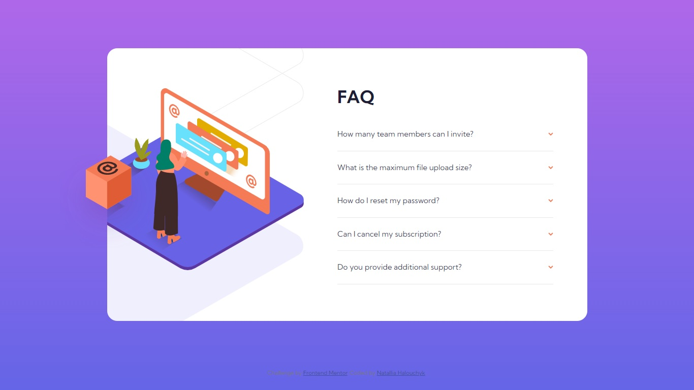

# Frontend Mentor - FAQ accordion card solution

This is a solution to the [FAQ accordion card challenge on Frontend Mentor](https://www.frontendmentor.io/challenges/faq-accordion-card-XlyjD0Oam). Frontend Mentor challenges help you improve your coding skills by building realistic projects.

## Table of contents

- [Overview](#overview)
  - [The challenge](#the-challenge)
  - [Screenshot](#screenshot)
  - [Links](#links)
- [My process](#my-process)
  - [Built with](#built-with)
  - [What I learned](#what-i-learned)
- [Author](#author)
- [Acknowledgement](#acknowledgement)


## Overview

### The challenge

Users should be able to:

- View the optimal layout for the component depending on their device's screen size
- See hover states for all interactive elements on the page
- Hide/Show the answer to a question when the question is clicked

### Screenshot




### Links

- Solution URL: [Add solution URL here](https://your-solution-url.com)
- Live Site URL: [Add live site URL here](https://your-live-site-url.com)

## My process

### Built with

- Semantic HTML5 markup
- CSS custom properties
- Flexbox
- JS(EventListener)


### What I learned

I tackled a lot the elements' positionning while doing this task. Some solutions were new and even surprising for me:
 - when an image is a child of a container, it can be set and positioned as a background image;
 - it's allowed to use more than 1 background image;
 - how to stick an image with absolute position in place while the screen width is changed:

```css
.woman-img{
  display: block;
  position: absolute;
  width: 18rem;
  margin: auto;
  left: 0;
  right: 0;
  top: -125%;
  bottom: 0;
}

```


## Author

- Website - [Add your name here](https://www.your-site.com)
- Frontend Mentor - [@NatalyHalouchyk](https://www.frontendmentor.io/profile/NatalyHalouchyk)
- LinkendIn - [](https://www.linkedin.com/in/natallia-halouchyk-5b600b225/)

##Acknowledgement

Thanks to the Frontend Mentor user [@eleswastaken](https://www.frontendmentor.io/profile/eleswastaken) who helped me to enhance my realization.
